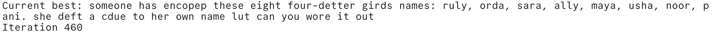

# GHCQ puzzle

Every year GHCQ make a "chrismas card" which has a set of puzzles. I wrote a
small program (cypher.rb) to help me manually work out the cypher.

Then, because I fancied it, I wrote a program to automatically solve the cypher.
It's _very_ basic, but does kind of work.

