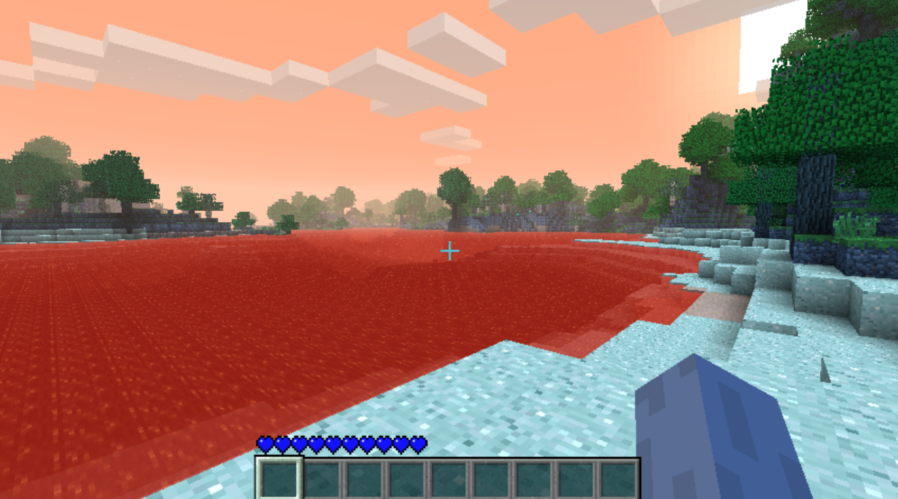
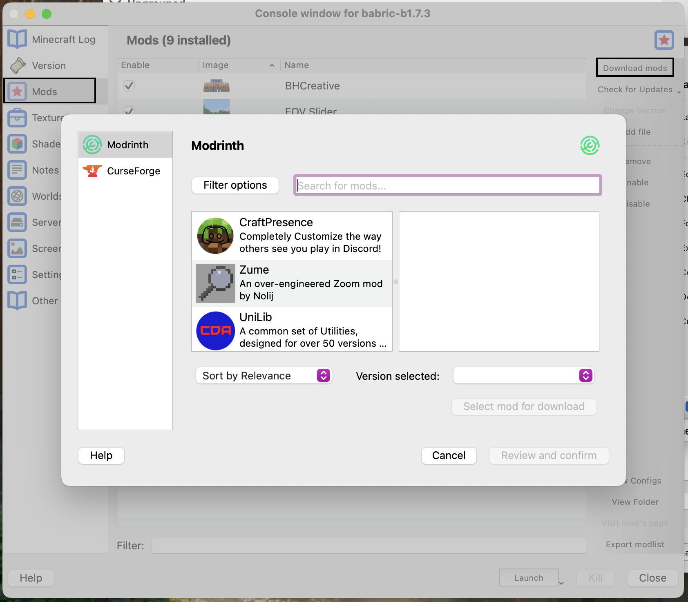

import LastUpdated from "../../../components/LastUpdated.astro";

<article>

# Playing Beta Minecraft

<LastUpdated filePath="src/pages/minecraft/beta-minecraft/01-playing-beta-minecraft.mdx" />

Playing a
[14 year old version of a game](https://minecraft.wiki/w/Java_Edition_Beta_1.7.3)
comes with its own challenges. Credit where it's due, Minecraft has rotted
pretty gracefully. As far as I'm aware - if you run beta 1.7.3 on Windows or
Linux with Java 1.8, it will run fine. On macOS, it's a little trickier. If
you start up the game, you'll see something like this with the colors
inverted:

This
[_seems_ to be an endianness issue](https://www.minecraftforum.net/forums/support/java-edition-support/3049963-red-and-blue-colors-seem-to-be-inverted).
On little endian machines (like aarch64 macs), lwjgl 2 seems to expect bgr
colors instead of rgb. I'm not entirely sure why, and the existing fixes don't
come with any explanation about how their fixes actually solve the problem. If anyone knows more about this, please contact me at [bgr@intherain.cloud](mailto:bgr@intherain.cloud).

Before I talk about fixing the problem, the first thing we need to do is figure
out how we want to launch the game. We need to modify the game's jar
file in order to run any modifications - or an inverted color fix. In the old
days, this used to be done by manually opening the jar file, dragging in some
modified classes, and re-packaging it again. This is not quite so lovely, so
players have come up with launchers that can apply patches to the jar for you.
There is a launcher called [betacraft](https://betacraft.uk) which applies a
very specific fix mod, but this launcher had signing issues on macOS so I opted
not to run it.

Instead, I looked at [MultiMC](https://multimc.org) and
[Prism](https://prismlauncher.org). Prism is a hard fork of MultiMC that came
about after a disagreement between the current MultiMC maintainer and the
original authors. I ended up using Prism because it seems much more actively
maintained. In Prism, after creating a profile for your desired Minecraft
version, you can click on the profile edit button, go to the "version" tab, and
click on the "Add agents" button which will let you select another jar-file
whose contents get applied to the game jar itself.

The first fix comes in the form of betacraft's
[legacyfix mod](https://github.com/betacraftuk/legacyfix). You can download the
latest version, add it as an agent, and you're off to the races. It has some
additional patches like fixing Minecraft skins too. If you don't want any
further mods, this is probably a good option to go for.

The second fix that I know of comes in the form of a
[Babric](https://babric.github.io) mod called
[gambac](https://github.com/DanyGames2014/gambac). I ended up going with this
option because it works with the Babric mod loader which gives better
compatibility with other mods.

Modding beta Minecraft has changed quite a bit in the last couple years.

Originally, you would use a tool called
[Minecraft Coder Pack](https://minecraft.wiki/w/Tutorial:Programs_and_editors/Mod_Coder_Pack)
or MCP for short. This tool would allow you to decompile and recompile Minecraft
& create what are known as "jar-mods" which directly change the game code.
Jar-mods typically have very poor compatibility with each other since two mods
that override the same file will end up with just half the required changes.

This is where modding APIs come in. Modding APIs come in the form of a single
jar-mod that can pull in multiple other modifications that are instead
consumers of a common API. Because each mod is an independent module, they often
behave much better together. The first mod loader for beta 1.7.3 was the now
deprecated
[ModLoaderMP](https://www.minecraftforum.net/forums/mapping-and-modding-java-edition/minecraft-mods/1272343-1-3-2-sdks-mods-v1-aug-18th-modloadermp-updated)
([original thread](https://www.minecraftforum.net/forums/mapping-and-modding-java-edition/minecraft-mods/1272333-risugamis-mods-updated)).
Some new mods are still written for this API or modern forks of it, but from
what I've seen, it doesn't seem to have as much steam behind it.

A more modern approach seems to be [Babric](https://babric.github.io) with
[StationAPI](https://stationapi.wiki). Babric is based on the relatively new
[FabricMC](https://fabricmc.net) project which was started as a fresh project
for modding release 1.8.0. Fabric is roughly equivalent to MCP in that it
provides utilities for compiling and decompiling the game jar. It then has a
FabricAPI layer which modders consume to actually implement their mods.

Babric is a fork of Fabric which back-ports the toolchain to beta and alpha
versions of the game, and Station API is a modding API that seems reasonably
inspired by the FabricAPI.

I've decided to go with this Babric + StationAPI combo since it seems to be the
way new mods are getting written for beta 1.7.3 and has the best community
support. A large selection of Babric and StationAPI mods are available on the
[Modrinth platform](https://modrinth.com/discover/mods?g=categories:babric),
including ports of popular mods like
[the Aether](https://modrinth.com/mod/aether-stapi) to this new toolchain.

You can set up a Babric profile in Prism by adding
[this custom profile](https://github.com/babric/prism-instance). You can then go
to the "mods" tab, click on the "add mods" button, and search for "StationAPI",
and install the API mod. Then, you can install any other compatible mods that
you fancy.

## How I set up my game

There are a wide range of mods available for Babric & StationAPI that can
completely change your game. I was quite keen on staying within the "spirit" of
beta 1.7.3. This manifested as only choosing mods that improved quality of life
without changing any gameplay mechanics.

The current list is as follows:

- [StationAPI](https://modrinth.com/mod/stationapi) - to support StationAPI mods
- [GlassConfigAPI](https://modrinth.com/mod/glass-config-api) - a configuration
  API that a handful of StationAPI mods use
- [Glass Networking](https://modrinth.com/mod/glass-networking) - another core
  API that _something_ needs
- [Gambac](https://modrinth.com/mod/gambac) - for fixing macOS related issues
- [Fov Slider](https://modrinth.com/mod/fov-slider) - in beta 1.7.3 the FOV is
  fixed to 70 so this lets us change it to a more reasonable 90
- [Inventory Tweaks](https://modrinth.com/mod/inventorytweaks) - brings modern
  inventory management shortcuts as well as a few additional tweaks from its
  modern namesake
- [BH Creative](https://modrinth.com/mod/bh-creative) - adds a creative world
  type that I can use for experimentation
- [Rei's Minimap StationAPI port](https://modrinth.com/mod/reis-minimap-ornithe-port) -
  the OG Rei's Minimap mod ported to StationAPI

I was a little on the fence about adding a minimap mod. I'm pretty good at
navigating in Minecraft, but it is nice to be able to make waypoints. I would
prefer something more thematic like the
[Antique Atlas mod](https://modrinth.com/mod/antique-atlas-4) so I might
consider back-porting it at some point.

</article>
