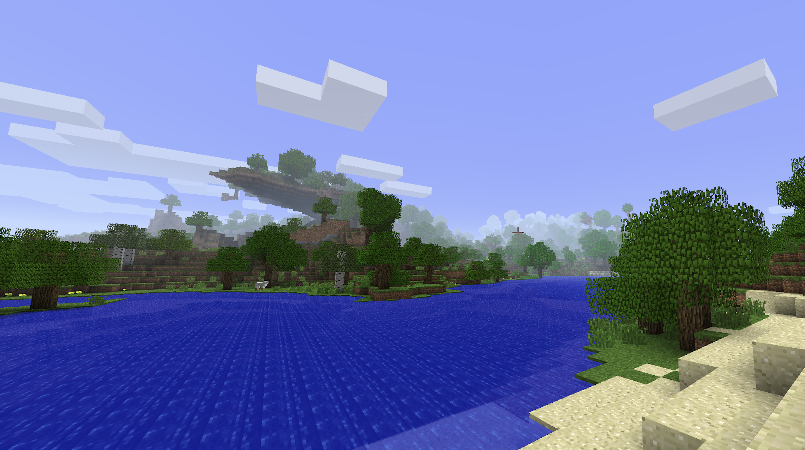

import LastUpdated from "../../../components/LastUpdated.astro";

<article>

# Beta Minecraft

<LastUpdated filePath="src/pages/minecraft/beta-minecraft/index.mdx" />

To satisfy my nostalgia for a version that can't be obtained anymore, I've been
playing Minecraft Beta 1.7.3.

There's quite a distinct charm to this version. The old alpha pocket edition
versions were limited to a tiny 256x256x127 world that you could call home.
Similarly, Minecraft versions pre release 1.2.1 had this same world height
limit of 127 blocks. With the shorter render distance and terrain that is much
more limited in height, it makes everything seem relatively bigger. In a modern
version of the game, building a house that is 50 blocks wide is not that large
compared to its surroundings. In the old versions, the same structure seems to
completely overtake the landscape.

That said, the game is relatively limited in what can be done. Beta 1.7.3 is yet
to introduce hoppers or comparators which really bring vanilla automation to
life. In this version, passive and hostile mob farms are limited to just leaving
piles of drops directly on the ground. Being a programmer at heart, I do want to
do a little more than that. As such, I've decided to play a run where I will
slowly introduce my own modded features for various game automation. It should
be noted that Buildcraft, Industrial Craft (1 & 2), and Minefactory Reloaded are
all available for Beta 1.7.3, but the source code is not available and they are
unofficially distributed as unsigned jars which makes me rather nervous.
Further, making my own tech mod is generally interesting to me.

- [Playing Beta Minecraft in 2025](/minecraft/beta-minecraft/01-playing-beta-minecraft)
{/* - [Depth First Caving](/minecraft/beta-minecraft/02-depth-first-caving) */}

</article>
