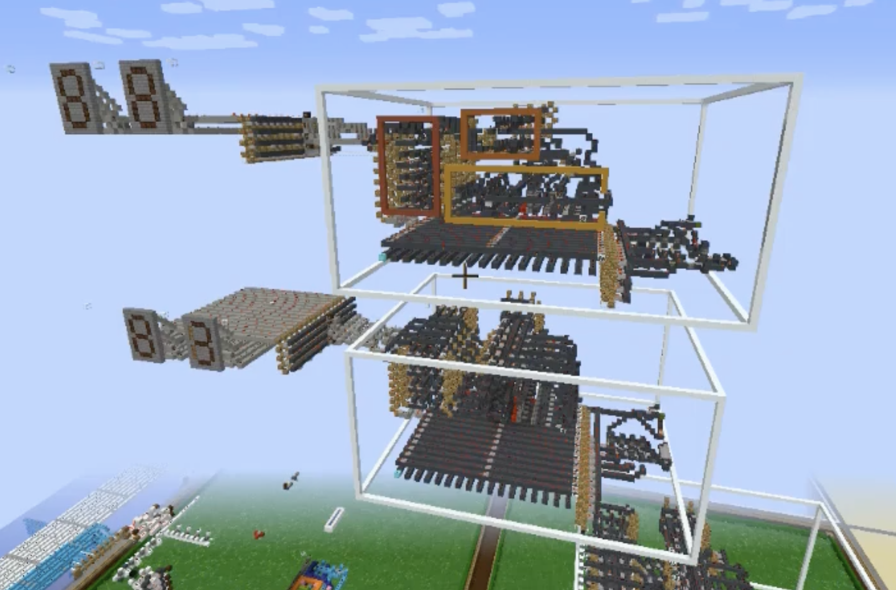

import LastUpdated from "../../components/LastUpdated.astro";

<article>

# Minecraft

<LastUpdated filePath="src/pages/minecraft/index.mdx" />

I've played Minecraft for a long time and have done pretty much everything there
is to do in the game. I've built computers with redstone, played technical
mod-packs, and built large scale mob farms. I don't play as much anymore, but if
I'm in the mood, it's often my go-to choice.

Here is a screenshot of a 4-bit CPU with four general purpous registers and two
oprand registers that I built when I was 16.

Recently I've been playing some Minecraft beta 1.7.3 for a bit of a nostalgia
trip. I never played beta 1.7.3 when it was in it's prime. I did however play
[pocket edition alpha 0.8](https://minecraft.wiki/w/Pocket_Edition_v0.8.0_alpha)
which used a terrain generator that was very similar to the pre beta 1.8
generation system.

- [Beta Minecraft Stories](/minecraft/beta-minecraft)

</article>
